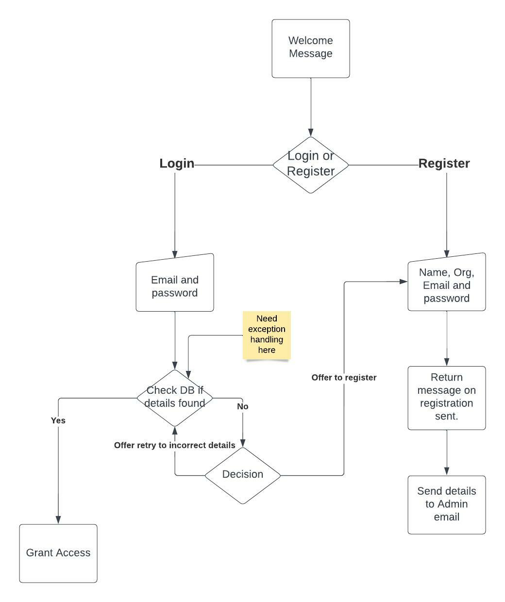

# Contents
* [**User Experience UX**](<#user-experience-ux>)
    *  [User Stories](<#user-stories>)
    * [Design](<#design>)
    * [Wireframes](<#wireframes>)
* [**Features**](<#features>)
    * [Current Features](<#current-features>)
    * [Future Features](<#future-features>)
* [**Technologies Used**](<#technologies-used>)
* [**Testing**](<#testing>)
    * [Validation](<#validation>)
    * [Testing User Stories from User Experience](<#testing-user-experienece>)
* [**Deployment**](<#deployment>)
* [**Credits**](<#credits>)
    * [**Content**](<#content>)
*  [**Acknowledgements**](<#acknowledgements>)

## Reminders

* Your code must be placed in the `run.py` file
* Your dependencies must be placed in the `requirements.txt` file
* Do not edit any of the other files or your code may not deploy properly

[View the live project here.]()

This project looks to collect tweets for the user and clean the data for investment and marketing analysis purposes. Will also provide sentiment score based on tweets collected and aggregate them together.

<h2 align="center"></h2>

## User Experience (UX)

## User stories

-   ### User

1.    I want a clear menu with options that are clear on intention.
2.    I want to able to log in and have my information stored so I can log in again.
3.    I want to be greeted by personlised message.
4.    I want to get real time data through the app.
5.    I want to be able to save this data to sheet to view in more organised way.
6.    I want to be able to access data offline and have it sent to my email for future reference.
7.    I want to be able to get sentiment data on my query of information.
8.    I want to be able to understand data that is being presented to me.
    
-   ### Site Owner

9.    I want users to have positive experience when using the app.
10.    I want users to understand and easily use the menu screen.
11.    I want to have record of users email and password and retrieve information for validation
12.    I want to provide user with clear message if incorrect information is entered.
13.    I want validation on data entry points such as user email and password.

*   ### Wireframes

    The flow for how the application operates was mapped out on lucidcharts

    * Highlevel overview wireframe image  
     

    * Login/Registration wireframe  
      

    * Micro 
    

[Back to top](<#contents>)

## Features

### Current Features

### Future Features

[Back to top](<#contents>)

## Technologies Used

### Languages Used

-   [Python](https://en.wikipedia.org/wiki/Python_(programming_language))

### Frameworks, Libraries & Programs Used

[Back to top](<#contents>)

## Testing

### Validation

### Testing User Stories from User Experience (UX) Section

### Testing User Experienece

-   #### First Time Visitor Goals

-   #### Returning Visitor Goals

-   #### Frequent User Goals

### Further Testing

### Known Bugs

- when attempting to hook up smtplib to tweet sentiment gmail account to send user registration froms. Recieved '[Errno 101] Network is unreachable' error
  message. Data online points to firewall issues. No known solution.

[Back to top](<#contents>)

## Deployment

## Creating the Heroku app

When you create the app, you will need to add two buildpacks from the _Settings_ tab. The ordering is as follows:

1. `heroku/python`
2. `heroku/nodejs`

You must then create a _Config Var_ called `PORT`. Set this to `8000`

If you have credentials, such as in the Love Sandwiches project, you must create another _Config Var_ called `CREDS` and paste the JSON into the value field.

Connect your GitHub repository and deploy as normal.

## Constraints

The deployment terminal is set to 80 columns by 24 rows. That means that each line of text needs to be 80 characters or less otherwise it will be wrapped onto a second line.

[Back to top](<#contents>)

## Credits

### Code

- Email validation and password validation information on use of regular expression was sourced here[GeeksforGeeks](https://www.geeksforgeeks.org/password-validation-in-python/)

- Regular expressions were taken from cheetsheet[MyGreatLearning](https://www.mygreatlearning.com/blog/regular-expression-in-python/)

- Regualr expressions of emojis was sourced from this cheatsheet[Github](https://gist.github.com/Alex-Just/e86110836f3f93fe7932290526529cd1)

#### Libraries

- Imported Tweepy library to help extend this project and to connect with the Twitter API [Tweepy](https://docs.tweepy.org/en/stable/)

- Gspread

- re - regualr expressions

- JSON

- getpass this is to hide password for user from terminal output to ensure their data is protected

- TextBlob is imported to help woth polarity analysis of tweets[TextBlob](https://textblob.readthedocs.io/en/dev/)

### Content

-   All content was written by the developer.

### Acknowledgements

The app was completed as a Portfolio 3 Project for the Full Stack Software Developer (e-Commerce) Diploma at the [Code Institute](https://codeinstitute.net/). I would like to thank my mentor Mo Shami, my class mates, the Slack community, and all at the Code Institute for their help and support. 

Also to my friends and family who helped test site & provide feedback and most importantly patient with me during this time!

[Back to top](<#contents>)