# Contents
* [**Project Goals**](<#project-goals>)
    *  [User Goals](#user-goals)
    *  [Site Owner Goals](#site-owner-goals)
* [**User Experience UX**](<#user-experience-ux>)
    *  [User Stories](<#user-stories>)
    *  [Scope](<#scope>)
    *  [Design](<#design>)
    *  [Technical Design](<#technical-design>)
* [**Features**](<#features>)
    * [Current Features](<#current-features>)
    * [Future Features](<#future-features>)
* [**Technologies Used**](<#technologies-used>)
    * [Languages Used](<#languages-used>)
    * [Frameworks Libraries & Programs Used](<#frameworks-libraries-programs-used>)
    * [Libraries](<#libraries>)
* [**Testing**](<#testing>)
    * [Validation](<#validation>)
    * [Testing User Stories from User Experience](<#testing-user-experienece>)
* [**Bugs**](<#bugs>)
* [**Deployment**](<#deployment>)
* [**Credits**](<#credits>)
    * [**Content**](<#content>)
*  [**Acknowledgements**](<#acknowledgements>)

## Project Goals
* The Tweet Analyzer application is the beginning of a real world application to allow users retrieve live stock data and get numerical representation of how that company is trending with real
world users of twitter. To help give stock traders a competitive advantage.
* The application enables user to retrieve live stock information and have it represented back to them in the terminal from the SP500 list.
* Combines it sentiment polarity of words used about company on Twitter. Sentiment polarity for an element defines the orientation of the expressed sentiment, i.e., it determines if the text expresses the positive, negative or neutral sentiment of the user about the entity in consideration. 
* Application also looks to provide weekly data for a given stock.

## User Experience (UX)

-   ### Target Audience
1. Users looking to retrieve live data from stock market and are looking for sentiment score of company to help with decisions on investsments in the S&P 500.  The S&P 500 tracks the market capitalization of the companies in its index. Market cap is the total value of all shares of stock that a company has issued. It's calculated by multiplying the number of shares issued by the stock price.

## User stories

-   ### User

1.    I want a clear menu with options that are clear on intention.
2.    I want to able to log in and know that my details are secure and no one has access to my account.
3.    I want to be able to register my information and have it stored so I can log in again.
4.    I want to get real time data through the application.
5.    I want to be able to have data sheet to view in more organised way in the application.
6.    I want to be able to access single stock data showing weekly trending information.
7.    I want to be able to get sentiment data on my query of information.
8.    I want to be able to understand data that is being presented to me.
    
-   ### Site Owner

9.    I want users to have positive experience when using the app.
10.   I want users to understand and easily use the menu screen.
11.   I want to have record of users email and password and retrieve information for validation
12.   I want to provide user with clear message if incorrect information is entered.
13.   I want validation on data entry points such as user email and password.
14.   I want to be able to update the users list by remongin from registration application.

## Scope

1. For first release, the scope is to rpovide users ability to register, login and retrieve live data.
2. Future scope includes adding ability for user to email or downloiad live data offline. Search multiple parameters and filtering of data.
3. Build internal alogrithm to assign sentiment to tweets.

### User Manual

Click Here for instructions for use

#### Overview

The Tweet analyzer is for the modeling of sentiment analysis to stock data.  It's purpose is to provide an easy way for investors to get real time stock assessments for trading or trading analysis to review prior to investing.  This is to help make better investment decisions and to try to see ahead of time how a stock will perform.

#### Welcome Screen

On the Welcome menu, you will be provdided with 2 options.

Operation: Input R(Register) or L(Login) letter(s) and press enter.

1: Login - This is portal by which users and admin users can login. Your details will be evaluted against database records. After details have been assessed you will be assigned access level.

2: Registration.  This directs users to fill in their details to become registered user. Once all fields have been filled out correctly you will be redirected back to this screen and member of the admin team will be in contact when you have been appproved.

#### User Menu

Purpose: To allow users to search for SP500 stock list for live stock data analysis & search live stock data by name.

Operation: Input numeric value and press enter key

1: Retrieve live data and sentiment polarity. The user is presented with the live data as it is written to Google sheet, when ready user is present with table of stock data which has live stock price, dividend, PE ratio and polarity.

Prompted Y:  Enter using y.  This returns user to Main menu when ready. All other keys prompt question again.

2: Gets week worth of stock data by searching name

- User is presented with list of stocks in SP500 list and can search for previous weeks worth of trading data for the stock

- Enter company: Valid cpany name from stocks sheet list presented.

Prompted Y:  Enter using y.  This returns user to Main menu when ready. All other keys prompt question again.

3: Return to Welcome menu:

- returns to main menu of applicaiton.

#### Admin Menu

1: View User list from Database.

- returns Table of usernames and emails of valid users.

Prompted Y:  Enter using y.  This returns user to Admin menu when ready. All other keys prompt question again.

2: View Admin list from Database.

- returns Table of usernames and emails of valid admin team members.

Prompted Y:  Enter using y.  This returns user to Admin menu when ready. All other keys prompt question again.

3: View Registered applications list from Database.

- User is presented of list of registration applications from database.

- From here user is prompted if they want to remove user. 

- Hot key of Y(Yes) if user presses any other key returns to Admin menu. 

- User enter numeric screen value to approve registration applicant. They registered user if approved is moved to approved users list in option 1 and delted from database as registeration applicant. 

 - Prompted Y:  Enter using y.  This returns user to Admin menu when ready. All other keys prompt question again.

4: Return to Welcome menu:

- returns to main menu of applicaiton.

## Technical Design

* The flow for how the application operates was mapped out on lucidcharts

Login and registration

Main application

Live stock Dataframe process

### Data Modeling

Live stock Dataframe process

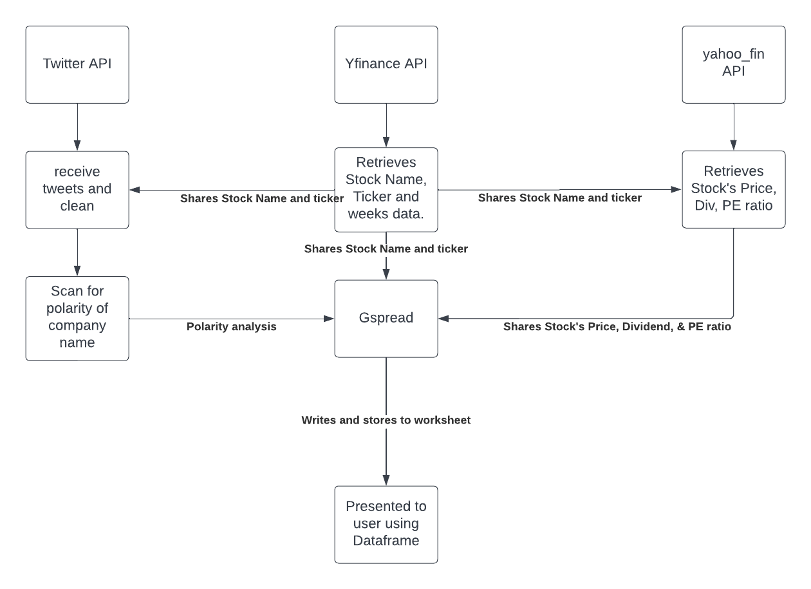

- 2 API's,Twitter & Yahoo finance, are userd to retrieve stock data, using the SP500 list provided by Yahoo.

- Stock's name and ticker value are retrieved, this is then used to collect further data on company such as price, PE ratio, dividend paid.

- This is then combined with polarity score, which is calculated by mapping words against a trend of positive and negative words used in tweets from the public. If the tweets sentiment polarity is above 0 it is coinsidered positive, if it is below zero it's negative and exactly zero is negative.

- This is then dispplayed to user to help make decisions on what stock is trending above market value based on feedback from news and public on Twitter.

- The above data has been limited to 5 company writes to google sheet taking the first in list due to time to write all 500 companies.(Full list in weeks data)

- In addition the number of tweets scanned is also limited, again this is with time contraints in mind due to waits in between API calls for demonstration.

- To achieve the above I have achieved using calling on Classes to inherit methods for Twitter & Stock API's. To achieve it also involved using Lists, Dictionaries and Dataframes to unpack, pack, assign variables and present the data.

[Back to top](<#contents>)

## Features

### Current Features

- User can login with their email and password validated by external Database.

- User can reigster their details, again this is checked at time of registration to avoid unnecessary follow up emails.

- User can view live data from stock market.

- User can view how that company is currently trending in real time, application parses tweets and adds snetiment score to data.

- User can search look back of previous weeks stock information for given company.

- Admin can approve registraitns in real time & automatically. This updates user sheet so user can then log in.

### Future Features

- Admin can reject registrations

- Admin can send email of verification of registration.

- User can download\export live data in form of excelsheet.

- User can email the live data.

[Back to top](<#contents>)

## Technologies Used

### Languages Used

-   [Python3](https://en.wikipedia.org/wiki/Python_(programming_language))

### Frameworks Libraries & Programs Used
1. [Git](https://git-scm.com/) - Git was used for version control.
2. [GitHub](https://github.com/) - Github was used as a remote repository to store project code.
3. [Gitpod](https://gitpod.io/) - Gitpod was the IDE user to write the code of the project code.
4. [Lucidcharts](https://www.lucidchart.com/) - Lucidcharts was used to map out the flowcharts for the project.
5. [Googlesheets](https://www.google.com/sheets/about/) -  Googlesheets was used to act as the backend database to store snesitive information to be queried.
6. [Google Cloud Platform](https://cloud.google.com/) - Google cloud is iused to manage the access to the google services, google authorization, google sheets.
7. [Twitter](https://developer.twitter.com/en) -  Twitter developer was used to access the Twitter API. With use of OAUthandler to access live tweets from timeline.
8. [Yahoo finance](https://finance.yahoo.com/) -  Yahoo finance was used to access the Yahoo Stock API, this gives appliction access to live data.

#### Libraries

1. time - Facilitate waits in application between operations such as database writes and prints.
2. os -  allow screen refersh between prints to not have terminal 'clogged' with information.
3. getpass - hide password on terminal screen for user protection.
4. json - reading of JSON files and data for API.
5. re - regualr expression was used to help with email verfication and to remove emoji's from tweets.
6. strings - used in validation to search for uppercase, lowercase, punctuation and digits.
7. datetime - to help finance stock queries to ensure it is realtime.

##### 3rd Party Libraries

1. [gspread](https://docs.gspread.org/en/latest/) - JUSTIFICATION: Efforts to source native python library available that gives access to add, update, remove or return data from googlesheets and to interact with the google cloud platform API. Based on this it was imported to facilate google sheet operations to provide external database.
2. [Textblob](https://textblob.readthedocs.io/en/dev/) -  JUSTIFICATION: Efforts to source native python library available were exhausted. To build algorithm to break text to binary and map to chart to build positive, negative & neutral data points to compare tweets against is outside the scope of the initial application version. 
3. [tweepy](https://www.tweepy.org/) - JUSTIFICATION: Efforts to source native python library available that gives access to live twitter API & data does not exist. This libaray was imported ot help provide access to this data so that the polarity of tweets can be accessed.
4. [yahoo_fin](https://pypi.org/project/yahoo-finance/) -  JUSTIFICATION: Efforts to source native python library available that gives access to live stock data is not accessible. This libabry was used to pull this infomraiton in. Otherwise static data would have to be used to populate data. This is needed in additiona of yfinance as it does not have PE ratio and stock dividend with yahoo_fin has.
5. [yfinance](https://pypi.org/project/yfinance/) - JUSTIFICATION: Efforts to source native python library available that gives access to live stock data is not accessible. This libabry was used to pull this infomraiton in. Otherwise static data would have to be used to populate data.
6. [pandas](https://pandas.pydata.org/) - JUSTIFICATION: Efforts to source native python library available that gives access to add, update, remove or return data in organised representation. This is a widely used libaryr by data scientists.

[Back to top](<#contents>)

## Testing

### Validation

### PEP8:

run.py

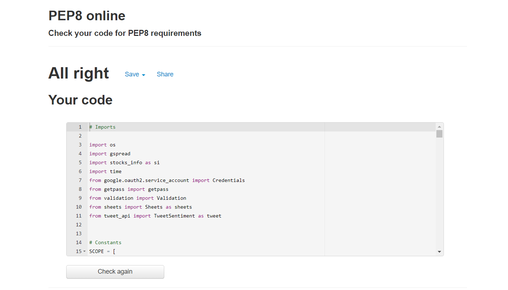

sheets.py

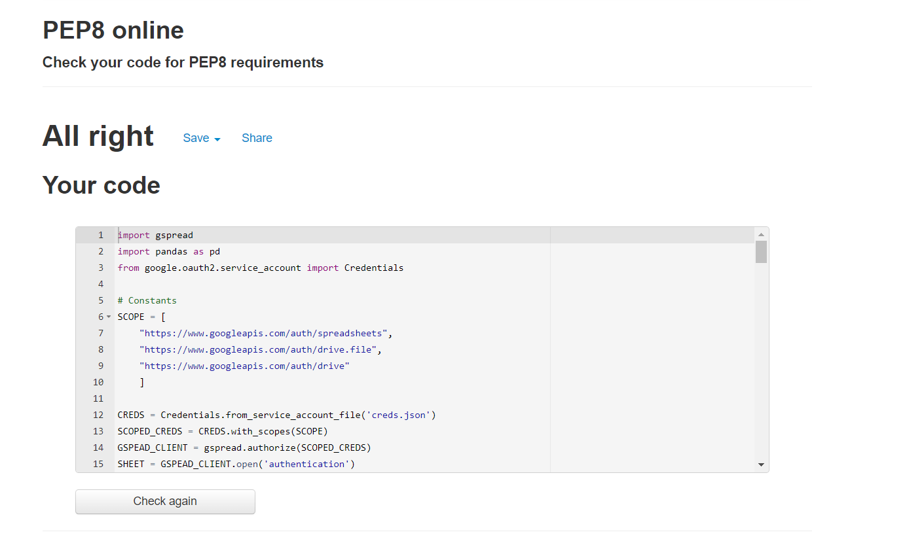

stocks_info.py

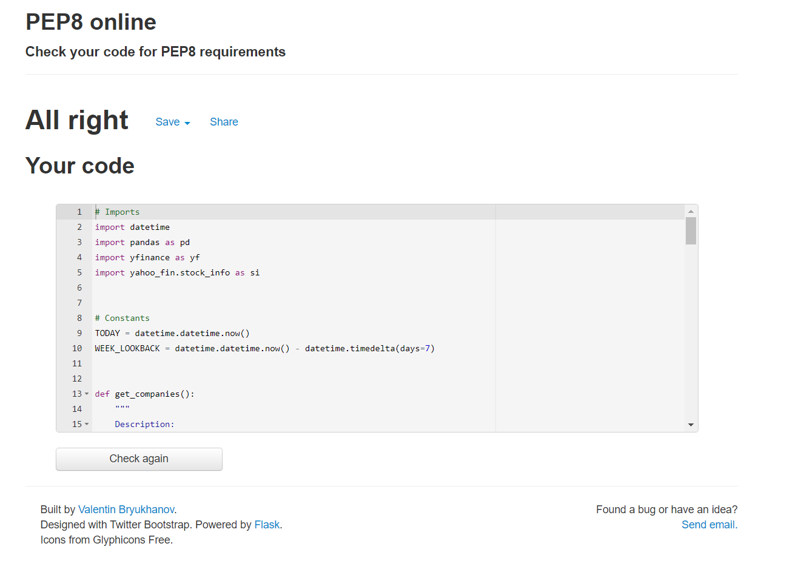

tweet_api.py

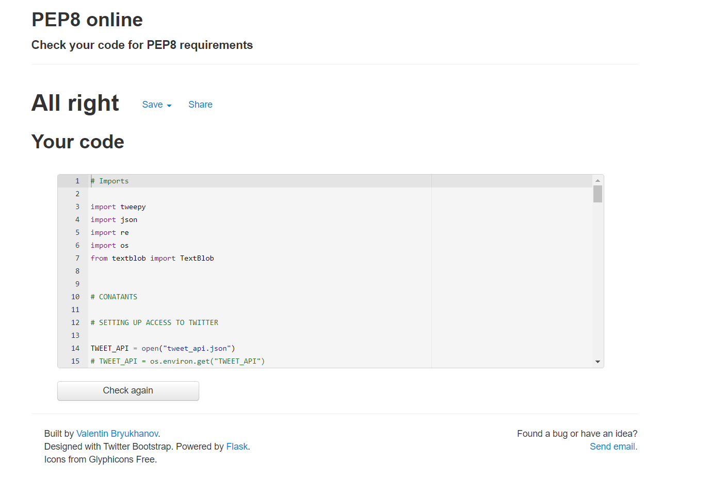

validation.py

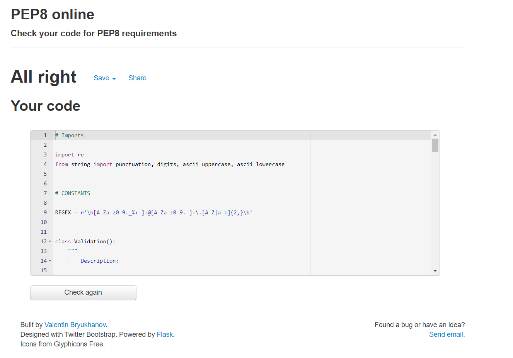

### Testing User Stories from User Experience (UX) Section

### Testing User Experienece
1. As a user I want a clear menu with options that are clear on intention.

| **Feature** | **Action** | **Expected Result** | **Actual Result** |
|-------------|------------|---------------------|-------------------|
| Find main menu       |      No action needed      | User is presented with welcome page | `Works as expected` |

Screenshots

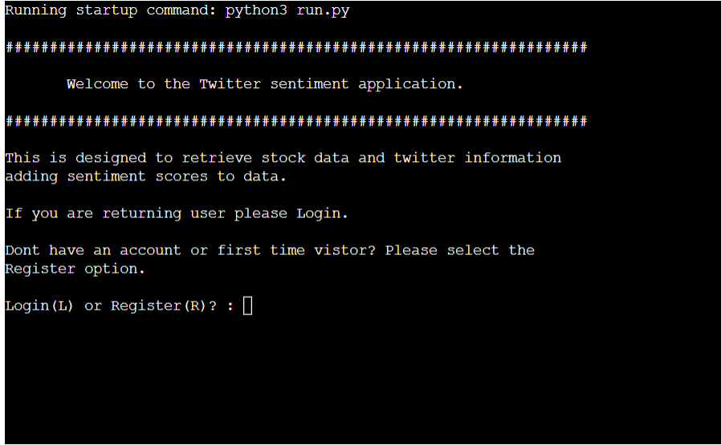

2. As a user I want to able to log in and know that my details are secure and no one has access to my account.

| **Feature**       |   **Action**        |   **Expected Result**                    |  **Actual Result**|
|-------------------|---------------------|------------------------------------------|-------------------|
| Login menu        |   Select option 1   | User is presented with LOG IN page       | `Works as expected` |

Screenshots

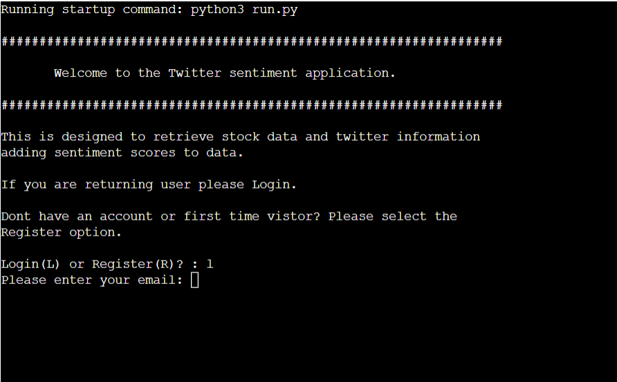

3. As a user I want to be able to register my information and have it stored so I can log in again.

| **Feature**       |   **Action**        |   **Expected Result**                    |  **Actual Result**|
|-------------------|---------------------|------------------------------------------|-------------------|
| Reistration menu  |   Select option 2   | User is presented with registration page | `Works as expected` |

Screenshots

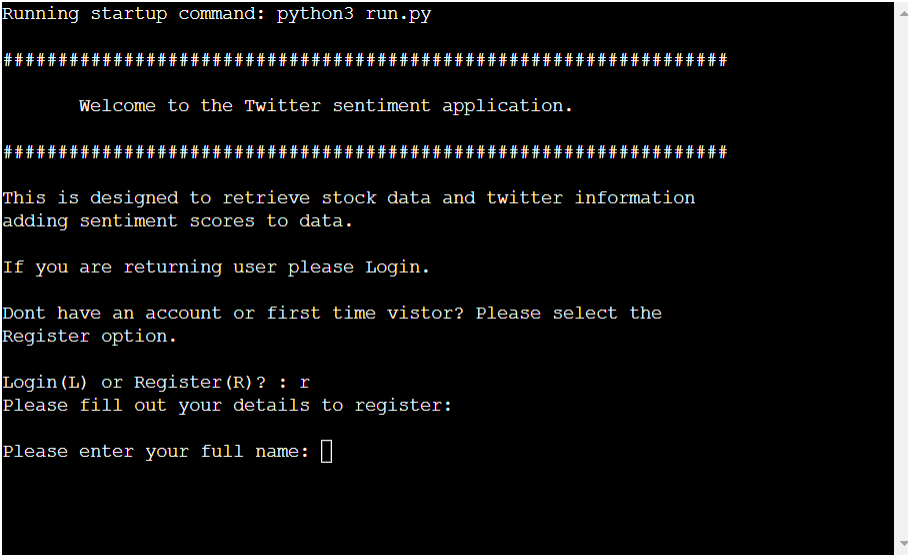

4. As a user I want to get real time data through the application.

| **Feature** | **Action**                       | **Expected Result**                                 | **Actual Result** |
|-------------|----------------------------------|-----------------------------------------------------|-------------------|
| Live Data   |   Select option 1 on User menu   | User is presented with live data from yahoo finance | `Works as expected` |

Screenshots

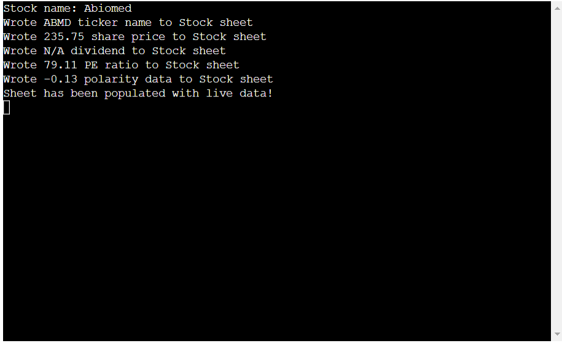

5. As a user I want to be able to have data sheet to view in more organised way in the application.

| **Feature** | **Action** | **Expected Result** | **Actual Result** |
|-------------|------------|---------------------|-------------------|
| Dataframes  |   Select option 1 or 2  on User menu  | User is presented with dataframe of stock information | `Works as expected` |

Screenshots

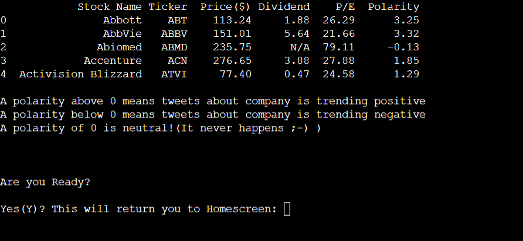

6. As a user I want to be able to access single stock data showing weekly trending information.

| **Feature** | **Action** | **Expected Result** | **Actual Result** |
|-------------|------------|---------------------|-------------------|
| Live Data  |   Select option 2   | User is presented with live data from yahoo finance for single stock | `Works as expected` |

Screenshots

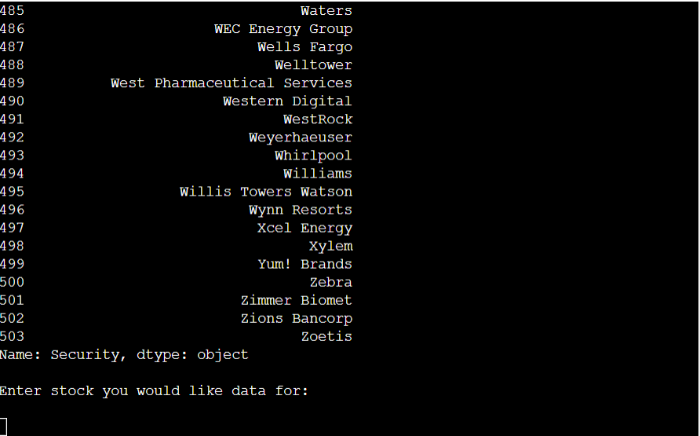

7. As a user I want to be able to get sentiment data on my query of information.

| **Feature** | **Action** | **Expected Result** | **Actual Result** |
|-------------|------------|---------------------|-------------------|
| Live Data  |   Select option 1   | User is presented with sentiment data as part of the live stock data | `Works as expected` |

Screenshots

8. As a user I want to be able to understand data that is being presented to me.

| **Feature** | **Action** | **Expected Result** | **Actual Result** |
|-------------|------------|---------------------|-------------------|
| Option 1 on User Menu |   Select option 1   | User is presented with explanation of how the sentiment scores are presented | `Works as expected` |

Screenshots

9. As a user I want users to have positive experience when using the app.

| **Feature** | **Action** | **Expected Result** | **Actual Result** |
|-------------|------------|---------------------|-------------------|
| Find main menu and User menu |   No action needed   |  No action needed  |  *No action needed*  |

10. As a user I want users to understand and easily use the menu screen.

| **Feature** | **Action** | **Expected Result** | **Actual Result** |
|-------------|------------|---------------------|-------------------|
| Find main menu  |   No action needed   | User is presented with main menu | `Works as expected` |

Screenshots

11. As a user I want to have record of users email and password and retrieve information for validation.

| **Feature** | **Action** | **Expected Result** | **Actual Result** |
|-------------|------------|---------------------|-------------------|
| Registration  |   Admin menu option 1 & 3  | Amdmin is presented with registration page & user page | `Works as expected` |

Screenshots

12. As a user I want to provide user with clear message if incorrect information is entered.

| **Feature** | **Action** | **Expected Result** | **Actual Result** |
|-------------|------------|---------------------|-------------------|
| validation  |   incorrect pasword or email   | User is presented with error message | `Works as expected` |

Screenshots

13. As a user I want validation on data entry points such as user email and password.

| **Feature** | **Action** | **Expected Result** | **Actual Result** |
|-------------|------------|---------------------|-------------------|
| validation  |   incorrect pasword or email    | User is presented with registration page that does not match DB | `Works as expected` |

Screenshots

14. As a user I want to be able to update the users list by removing from registration application.

| **Feature** | **Action** | **Expected Result** | **Actual Result** |
|-------------|------------|---------------------|-------------------|
| Registration  |   Admin menu option 3  | User is presented with registration page & can register user | `Works as expected` |

Screenshots

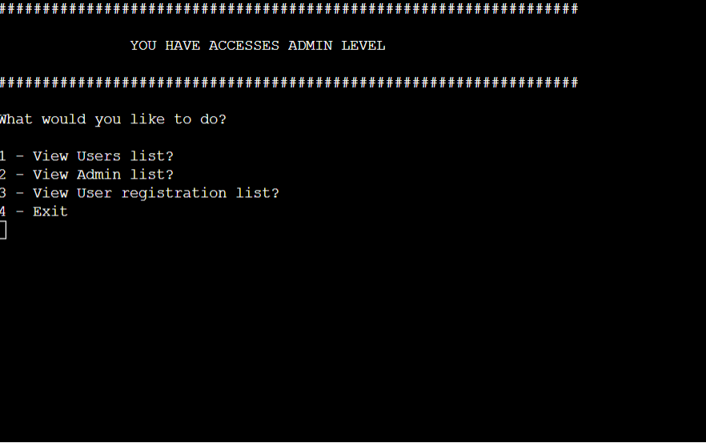

  
                                         
                                       
## Bugs

| **Bug** | **Fix** |
| ----------- | ----------- |
| There is a bug when the incorrect option is selected in login and registration in the welcome function. |   Removing additonal elif from validaiton.   |
| with gspread there is an API limit of 500 requests per 100 seconds per project and 100 requests per 100 seconds per user. Due to this when writing the company name and ticker name to stock data |sheet for user was getting 409 error code | added 2 second wait between writes to sheet |
| heroku deployement with twitter API keys. Tutor support resolved issue of file missing but presented new issues of keys not being recognised and bad response 404. | Adding keys to config vars and removing quotations credit[github](https://github.com/duttashi/scrapers/issues/21) and [heroku docs](https://devcenter.heroku.com/articles/config-vars#accessing-config-var-values-from-code)
| when attempting to hook up smtplib to tweet sentiment gmail account to send user registration forms. Recieved '[Errno 101] Network is unreachable' error message. Data online points to firewall issues  |  No known solution. |
|  pandas append is being depreciated for concat. This leads to print out to terminal of warning message printing to terminal.  | No known solution. |
|  User was incorrectly being redirected to admin menu after exiting live data section. | removed admin ready function and put in user ready in place. |
| There is a bug when the incorrect option is entered on user passowrd in resgistration |   Addressed this by adding return False to func and also addressing greater than or equal to   |

[Back to top](<#contents>)

## Deployment

This application has been deployed from Github using Heroku. Here's how:

1. Create an account at heroku.com
2. Create a new app, add app name and your region
3. Click on create app
4. Go to "Settings"
5. Under Config Vars, add your sensitive data (creds.json for example)
6. For this project, I set buildpacks to and in that order.
7. Go to "Deploy" and at "Deployment method", click on "Connect to Github"
8. Enter your repository name and click on it when it shows below
9. Choose the branch you want to buid your app from
10. If desired, click on "Enable Automatic Deploys", which keeps the app up to date with your Github repository

### Forking the GitHub Repository 

By forking this GitHub repository you are making a copy of the original to view or make changes without affecting the original. You can do this by following these steps...

1. Log into your GitHub account and find the [repository](https://github.com/dannymagnus/CI_MS3_MitsurukiFMS).
2. Click 'Fork' (last button on the top right of the repository page).
3. You will then have a copy of the repository in your own GitHub account. 

### Making a Local Clone

1. Log into your GitHub account and find the [repository](https://github.com/dannymagnus/CI_MS3_MitsurukiFMS).
2. Click on the 'Code' button (next to 'Add file'). 
3. To clone the repository using HTTPS, under clone with HTTPS, copy the link.
4. Then open Git Bash.
5. Change the current working directory to where you want the cloned directory to be made.
6. In your IDE's terminal type 'git clone' followed by the URL you copied.
7. Press Enter. 
8. Your local clone will now be made.

## Constraints

The deployment terminal is set to 80 columns by 24 rows. That means that each line of text needs to be 80 characters or less otherwise it will be wrapped onto a second line.

[Back to top](<#contents>)

## Credits

### Code

- Email validation and password validation information on use of regular expression was sourced here: [GeeksforGeeks](https://www.geeksforgeeks.org/password-validation-in-python/)

- Regular expressions were taken from cheetsheet listed here as knowledge of email capture was not known, it was sourced here: [MyGreatLearning](https://www.mygreatlearning.com/blog/regular-expression-in-python/)

- Regualar expressions of emojis was sourced from this cheatsheet as knowledge of emoji scraping was not known, it was sourced here: [Github](https://gist.github.com/Alex-Just/e86110836f3f93fe7932290526529cd1)

- Dataframes information was sourced from here: [w3schools](https://www.w3schools.com/python/pandas/pandas_dataframes.asp)

- Manipulation of spreadhseets was sourced from here: [gspread](https://docs.gspread.org/en/latest/user-guide.html)

- How to set dates for stock look back was sourced here: [python.org](https://docs.python.org/3/library/datetime.html#timedelta-objects)

- Yahoo finance reference for all stock related queries was sourced from here: [algotrading101](https://algotrading101.com/learn/yahoo-finance-api-guide/)

- Gspread formating was sourced from here: [google developer](https://developers.google.com/sheets/api/reference/rest/v4/spreadsheets/cells)

- All Twitter API information was sourced from here: [twitter developer](https://developer.twitter.com/en)

- All Twitter API queries using the various arguements was sourced from here: [tweepy](https://www.tweepy.org/)

- All Yahoo finance API queroes and various arguements was sourced from here: [yfinance](https://pypi.org/project/yfinance/) 

### Content

-   All content was written by the developer.

### Acknowledgements

The app was completed as a Portfolio 3 Project for the Full Stack Software Developer (e-Commerce) Diploma at the [Code Institute](https://codeinstitute.net/). I would like to thank my mentor Mo Shami, both tutors Gemma and Scott, my class mates, the Slack community, and all at the Code Institute for their help and support. 

Also to my friends and family who helped test site & provide feedback and most importantly patient with me during this time!

[Back to top](<#contents>)